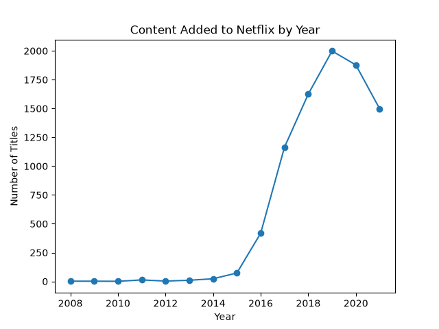
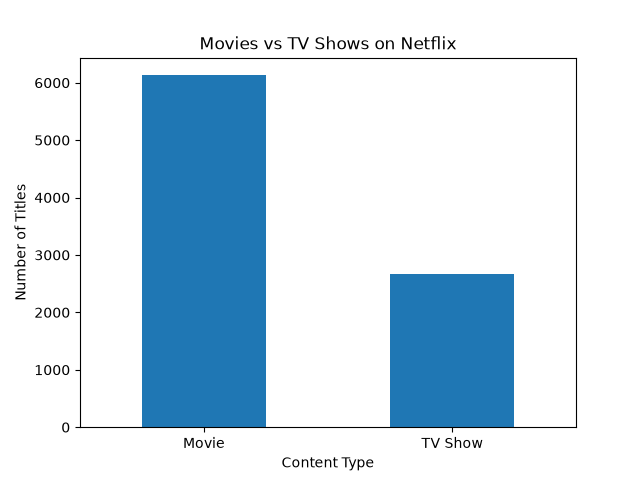
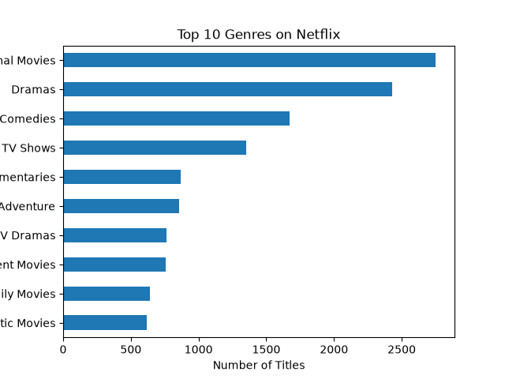
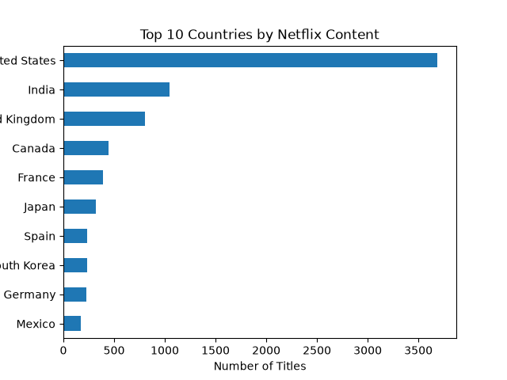
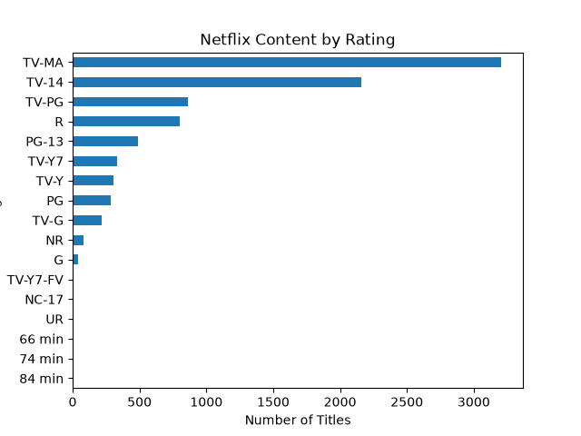

# Netflix Python & SQL Analysis

## Project Overview

This project analyzes the Netflix Titles dataset to understand patterns and trends in Netflix's content library.

The project uses Python, Pandas, Matplotlib, and SQL to perform data cleaning, exploratory data analysis (EDA), and data visualization.

The analysis focuses on questions such as:
- How has Netflix's content library changed over time?
- What is the distribution between Movies and TV Shows?
- Which genres are most common?
- Which countries contribute the most content?
- What are the most common content ratings?

---

## Business Questions

The project aims to answer the following questions:

1. How many titles were added to Netflix each year?
2. What is the distribution of Movies vs TV Shows?
3. What are the top 10 genres on Netflix?
4. Which countries have produced the most Netflix content?
5. What is the distribution of Netflix content by rating?

---

## Dataset

The dataset contains information about Netflix movies and TV shows, including:

- Title
- Type
- Director
- Cast
- Country
- Date Added
- Release Year
- Rating
- Duration
- Listed In (Genres)
- Description

The dataset is stored in:

`netflix_titles.csv`

---

## Tools & Technologies

- **Python**
- **Pandas** – Data cleaning and analysis
- **Matplotlib** – Data visualization
- **SQL** – Data querying and analysis
- **Git & GitHub** – Version control

---

## Data Cleaning

The dataset was prepared for analysis using Pandas.

The cleaning process includes:

- Loading the CSV dataset
- Converting the `date_added` column into a datetime format
- Handling missing values where required
- Splitting multi-value genre and country fields
- Preparing the data for analysis and visualization

---

## Exploratory Data Analysis

### 1. Content Added to Netflix by Year

This analysis shows how the number of titles added to Netflix has changed over time.



---

### 2. Movies vs TV Shows

This visualization compares the number of Movies and TV Shows available in the dataset.



---

### 3. Top 10 Genres

This analysis identifies the most common genres/categories in Netflix's content library.



---

### 4. Top 10 Countries

This visualization shows the countries contributing the highest number of titles to the Netflix dataset.



---

### 5. Content by Rating

This analysis shows the distribution of Netflix content across different ratings.



---

## Key Insights

The analysis helps identify important patterns in Netflix's content library, including:

- The distribution of Movies and TV Shows.
- The growth of Netflix's content additions over the years.
- The most frequently represented genres.
- Countries contributing the largest amount of content.
- The distribution of content across different ratings.

*Detailed numerical insights will be added after completing the full analysis.*

---

## Project Structure

```text
Netflix-Python-SQL-Analysis/
│
├── screenshots/
│   ├── step1_content_added_by_year.png
│   ├── step2_movies_vs_tv_shows.png
│   ├── step3_top_10_genres.png
│   ├── step4_top_10_countries.png
│   └── step5_content_by_rating.png
│
├── analysis.py
├── netflix_titles.csv
└└── README.md

### Key Insights

- Netflix's content library has grown significantly over the years.
- Movies make up a larger share of the catalog than TV Shows.
- The United States contributes a significant amount of Netflix content.
- The analysis identifies the most common genres and content ratings.
- Recent years show changes in Netflix's content release patterns.